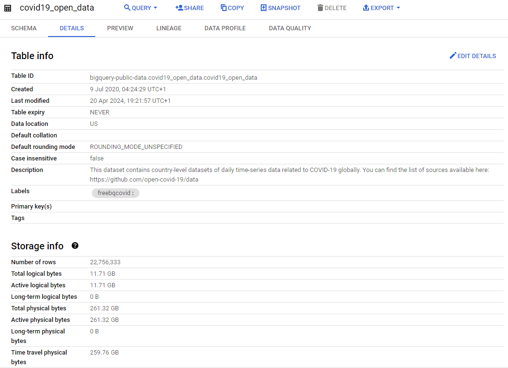
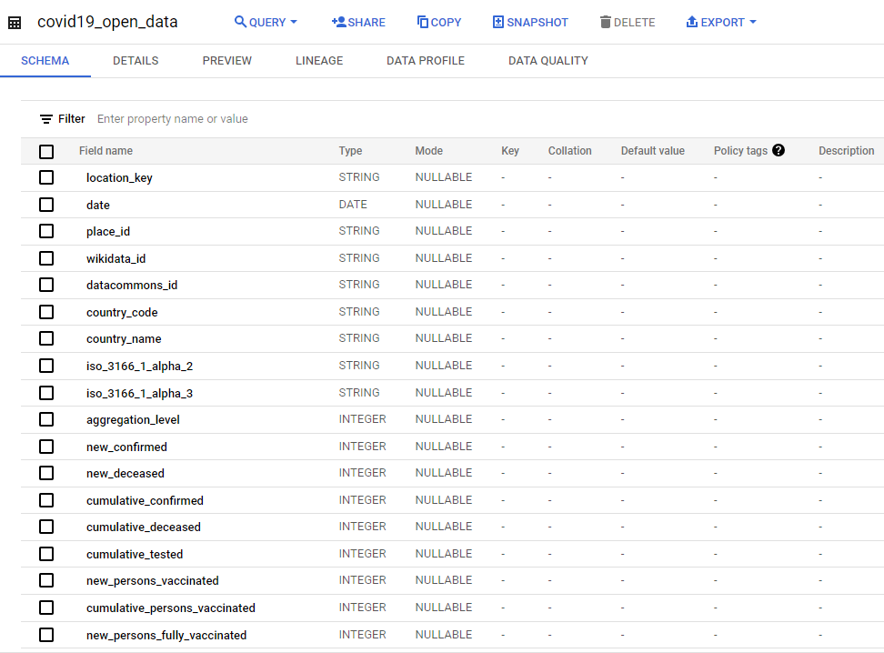
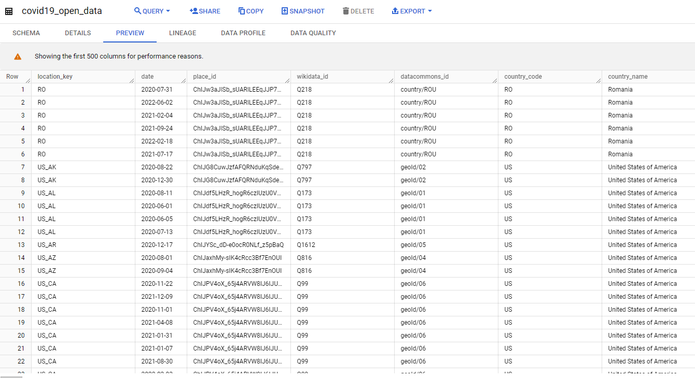

# Covid19
In this project, I perform some data analyses over the public Covid19 repository published by Google at https://console.cloud.google.com/marketplace/product/bigquery-public-datasets/covid19-open-data and https://github.com/open-covid-19/data.

The repository contains country-level datasets of daily time-series data related to COVID-19 globally. It includes data relating to demographics, economy, epidemiology, geography, health, hospitalizations, mobility, government response, and weather.

For this analysis I used exclusively the **Google Cloud BigQuery** tool as an exercise to explore its main capabilities.

## Introduction
The COVID-19 pandemic, caused by the novel coronavirus SARS-CoV-2, emerged in December 2019 in Wuhan, China, before rapidly spreading globally, challenging societies, economies, and healthcare systems worldwide. As of the latest data, the virus has infected millions of people and claimed hundreds of thousands of lives across the globe, having profound socio-economic implications, disrupting industries, prompting widespread lockdowns, and exacerbating existing inequalities. Understanding the dynamics of the COVID-19 epidemic is paramount for informing public health measures, mitigating its impact on society and the economy, and ultimately charting a path toward recovery and resilience.

## Methodology
This project consists of a series of analysis over the Covid19 repository to have insights that helps to understand the various caracteristics of the pandemic. To perform this analysis I created and executed SQL statements in the repository to retrieve answers for the questions I propose. I also used some functionalities available in BigQuery to understand and visualize the repository.

## About Google BigQuery
BigQuery is Google Cloud's fully managed, petabyte-scale, and cost-effective analytics data warehouse that lets you run analytics over vast amounts of data in near real time. With BigQuery, there's no infrastructure to set up or manage, letting you focus on finding meaningful insights using GoogleSQL and taking advantage of flexible pricing models across on-demand and flat-rate options. More information about BigQuery can be found at https://cloud.google.com/bigquery/docs.

## Part 1 - Understanding the Covid19 dataset
The screenshot below provides some interesting information about this dataset:

By the image we can see that the dataset:
* It is up to date with the date I wrote this article, which means it has been maitained by a pipeline (field 'Last modified')
* It is configured to never expire (field 'Table expiry')
* It is located in the cloud servers based in US (field 'Data location')
* It has an incredible number of **22.756.333 (22,7 million) lines!**
* It allocates (up to date) 11,71 GB of logical and 261,32 GB of physical space.

In the same place of BigQuery it also possible to check the dataset's SCHEMA, which seems to have more than **a hundred fields!**, showing how really complex it is:

Finally, let's have a preview of the data by clicking in the 'Preview' tab:

OK, that's a really interesting dataset! So let's do some analysis over it!
